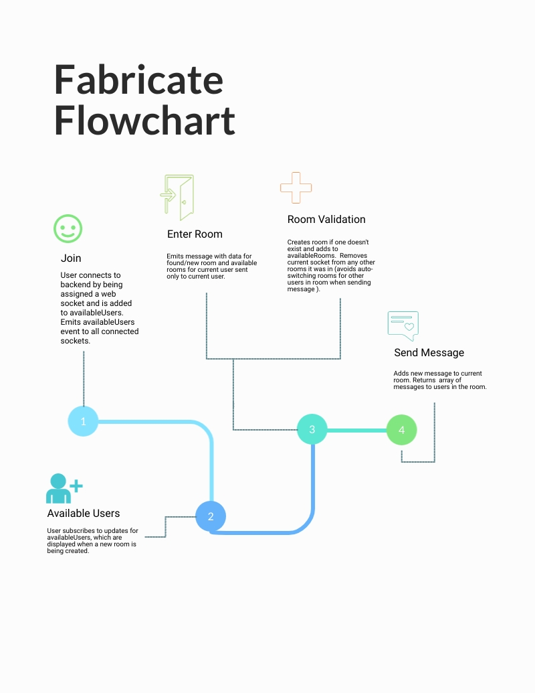
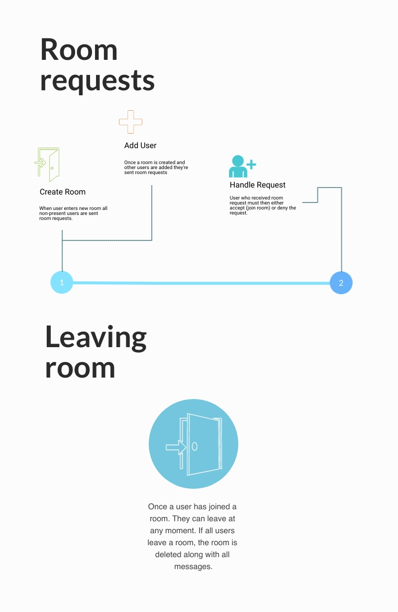

# Fabricate

Fabricate is a multi-user websocket based group chat application.

## Installation

Use the node package manager [npm](https://docs.npmjs.com/cli/v6/commands/npm-install) to install dependencies.

## Backend Usage

```node
cd chat-server
npm install
npm start server.js
```

## Frontend Usage

```node
cd frontend-server
npm install
npm install -g angular-cli
ng serve --o
```

## Backend Testing

```node
cd chat-server
npm install
npm test
```

## Frontend Testing

```node
cd frontend-server
npm install
npm install -g angular-cli
ng test
```

## Flowchart




## License
[MIT](https://choosealicense.com/licenses/mit/)